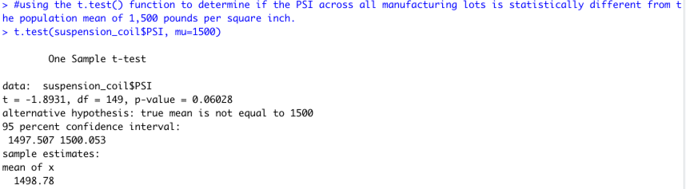

# MechaCar_Statistical_Analysis

## Linear Regression to Predict MPG
- Q1: Which variables/coefficients provided a non-random amount of variance to the mpg values in the dataset?

In the summary output, each Pr(>|t|) value represents the probability that each coefficient contributes a random amount of variance to the linear model.
According to the result, **vehicle_length** and **ground_clearance** (and **intercept**) are less likely to provide random amounts of variance to the linear model. Vehicle_length and ground_clearance have a significant impact on mpg.

- Q2: Is the slope of the linear model considered to be zero? Why or why not?

The intercept is statistically significant and not zero. The vehicle_length and ground_clearance have a significant impact on the dependent variable, which means the linear model is less likely to be determined by random chance and error. Therefore, the slope is NOT considered to be zero.

- Q3: Does this linear model predict mpg of MechaCar prototypes effectively? Why or why not?

According to the result, the r-squared value is 0.71. The r-squared value is known as the coefficient of determination and represents how well the regression model approximates real-world data points. In most cases, the r-squared value will range between 0 and 1. With the r-squared value being 0.71 for the result, we can say that the linear model does predict the mpg of MechaCar prototypes effectively. But also have room (such as including other variables that could have an impact to the mpg in the model) to improve to make the model more effective.

## Summary Statistics on Suspension Coils
- Q: The design specifications for the MechaCar suspension coils dictate that the variance of the suspension coils must not exceed 100 pounds per square inch. Does the current manufacturing data meet this design specification for all manufacturing lots in total and each lot individually? Why or why not?

From the result we can see the result for all lots, the variance is 62.29 which does not exceed the 100 pounds per square inch design specification.

From the results for each lot, we can see that the variance for lot 1 and lot 2 are 0.98, and 7.47 respectively. For lot 3, the variance is 170.29, which exceeds the 100 pounds per square inch design specification.

## T-tests on Suspension Coils
**Result of t-test on suspension coils for all lots**

- The significant level is 0.05.

- Ho: There are no significantly difference between sample mean and population mean.
- Ha: There are significantly difference between sample mean and population mean.

From the result for all lots, we can see the p-value is 0.06 which is bigger than the significant level of 0.05. Therefore, we fail to reject the null hypothesis, so **there is no significant difference between the sample mean and population means**.

**Result of t-test on suspension coils for each lot**

- The significant level is 0.05.

- Ho: There is no significant difference between the sample mean and population mean.
- Ha: There is a significant difference between the sample mean and population mean.

1. Lot 1
Lot 1 t-test result shows it has a p-value of 1, which is bigger than the significant level 0.05. Therefore, we fail to reject the null hypothesis, so **there are no significantly difference between sample mean and population mean**.

2. Lot 2
Lot 2 t-test result shows it has a p-value of 0.6, which is bigger than the significant level of 0.05. Therefore, we fail to reject the null hypothesis, so **there is no significant difference between the sample mean and population mean**.

3. Lot 3
Lot 3 t-test result shows it has a p-value of 0.04, which is smaller than the significant level of 0.05. Therefore, we reject the null hypothesis, so **there is a significant difference between the sample mean and population mean**.

## Study Design: MechaCar vs Competition
The current data has 6 variables: vehicle_length, vehicle_weight, spoiler_angle, ground_clearance, AWD, and mpg.

When it comes to the interest of consumers, cost, city and highway fuel efficiency, horsepower, maintenance cost, and safety rating are some of the metrics we can take into consideration.

Considering the lifestyle and cost of living now, the cost, city, and highway fuel efficiency, and maintenance cost will be good metrics to test.

- Cost:
To test cost, we could multiple linear regression. The cost could be the dependent variable. Other variables such as vehicle length, vehicle weight, manual or automatic, safety rating, color, etc. And to test which variable(s) has a more significant impact on the cost.

The null hypothesis for the test could be the impact of independent variables to cost will be the same.
The alternative hypothesis for the test could be the impact of independent variables to cost will be different(some have more impact, some less).

- City and highway fuel-efficiency:
To test city and highway fuel efficiency, we could use multiple linear regression again and will have two different models, one for city fuel efficiency, and one for highway fuel efficiency.
The city and highway fuel efficiency will be the dependent variables. The independent variables could be vehicle length, vehicle weight, spoiler angle, ground clearance, cylinder number, horsepower, drive type, etc. 

The null hypothesis for the test could be the impact of independent variables will have the same impact on city/highway fuel efficiency.
the alternative hypothesis for the test could be the independent variables will have a different level of impact on city/highway fuel efficiency.

- Maintenance cost:
To test maintenance cost, we can use one sample t-test, to see if the mean of the vehicle's yearly maintenance cost differs from the population mean.

The null hypothesis could be there are no statistical differences between the sample mean and the population mean.
The alternative hypothesis could be there is a statistical difference between the sample mean and the population mean.
